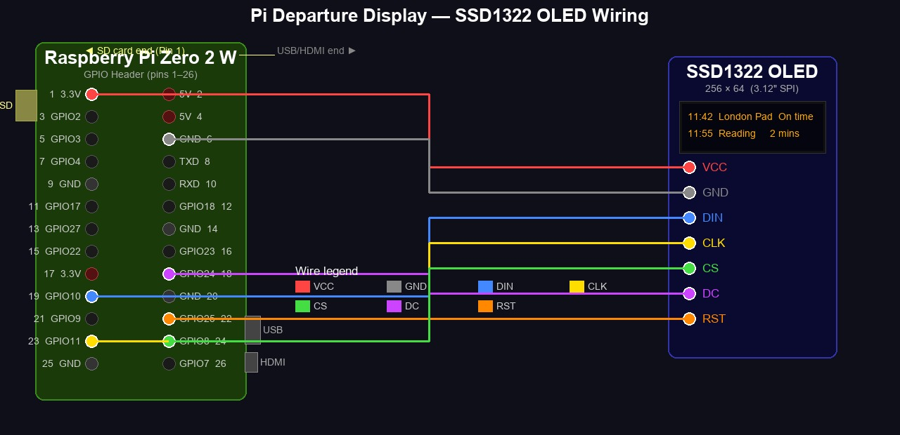

# Pi Train Departure Display

Live UK National Rail departure board on a Raspberry Pi Zero W with a 256×64 SSD1322 SPI OLED.

Based on [chrisys/train-departure-display](https://github.com/chrisys/train-departure-display), redeployed for native Raspberry Pi OS with systemd (no Docker, no Balena).

---

## Before You Start

- Register for a free [National Rail OpenLDBWS API key](https://realtime.nationalrail.co.uk/OpenLDBWSRegistration) — allow **2–4 weeks** for approval
- You will also need your station's **3-letter CRS code** (e.g. `WAT` for London Waterloo, `PAD` for Paddington) — look yours up at [nationalrail.co.uk](https://www.nationalrail.co.uk)

---

## Hardware

| Component | Detail |
|---|---|
| Pi | Raspberry Pi Zero W (or Zero 2W, 3B, 3B+, 4) |
| Display | SSD1322 256×64 OLED, 7-pin SPI (e.g. DIYTZT 3.12" module) |
| OS | Raspberry Pi OS Lite **(Bookworm)**; 32-bit for Zero W, 32 or 64-bit for Zero 2W |

### GPIO Wiring

Pin 1 is at the corner of the GPIO header closest to the **SD card slot**.



```
  ◄── SD card                                          USB / HDMI ──►

  Pin 1  [ 3V3 ●]── VCC    [  5V  ]  Pin 2
  Pin 3  [ SDA  ]          [  5V  ]  Pin 4
  Pin 5  [ SCL  ]          [ GND ●]── GND          Pin 6
  Pin 7  [GPIO4 ]          [ TXD  ]  Pin 8
  Pin 9  [ GND  ]          [ RXD  ]  Pin 10
  Pin 11 [GPIO17]          [GPIO18]  Pin 12
  Pin 13 [GPIO27]          [ GND  ]  Pin 14
  Pin 15 [GPIO22]          [GPIO23]  Pin 16
  Pin 17 [ 3V3  ]          [GPIO24●]── DC          Pin 18
  Pin 19 [GPIO10●]── DIN   [ GND  ]  Pin 20
  Pin 21 [ GPIO9]          [GPIO25●]── RST         Pin 22
  Pin 23 [GPIO11●]── CLK   [ GPIO8●]── CS         Pin 24
  Pin 25 [ GND  ]          [ GPIO7 ]  Pin 26

  ● = wire to OLED
```

| OLED Pin | Function | GPIO | Physical Pin |
|---|---|---|---|
| VCC | 3.3V power | 3.3V | Pin 1 |
| GND | Ground | GND | Pin 6 |
| DIN | SPI data (MOSI) | GPIO 10 | Pin 19 |
| CLK | SPI clock (SCLK) | GPIO 11 | Pin 23 |
| CS | Chip select | GPIO 8 (CE0) | Pin 24 |
| DC | Data/command | GPIO 24 | Pin 18 |
| RST | Reset | GPIO 25 | Pin 22 |

---

## Installation

### Step 1 — Set up Raspberry Pi Connect (before flashing)

Create a free account at [connect.raspberrypi.com](https://connect.raspberrypi.com) — you'll need this to access the Pi remotely once it's running.

### Step 2 — Flash the SD card

1. Download [Raspberry Pi Imager](https://www.raspberrypi.com/software/) on your computer
2. Choose **Raspberry Pi OS Lite (Bookworm)** — 32-bit for Zero W; either 32 or 64-bit for Zero 2W
3. Click **Next → Edit Settings** before writing and configure **all of the following** — this avoids needing a keyboard or monitor on first boot:

   **General tab:**
   - Set hostname, username, and password
   - Configure your Wi-Fi SSID and password
   - Set locale/timezone

   **Services tab:**
   - Tick **Enable SSH** → Use password authentication

   **Options tab:**
   - Tick **Enable Raspberry Pi Connect**

4. Click **Save → Yes**, then write the image to the SD card

### Step 3 — Boot and connect

1. Insert SD card, power on the Pi — wait ~90 seconds for first boot
2. Go to [connect.raspberrypi.com](https://connect.raspberrypi.com) → your Pi should appear → click **Remote shell**

> **Note:** The Zero 2W supports remote shell only. Screen sharing requires a Pi 4+ with a desktop OS.

### Step 4 — Download and run the installer

**Important:** Download the script before running it — piping directly from curl breaks the interactive prompts:

```bash
curl -fsSL https://raw.githubusercontent.com/OktaneZA/PiDepartures/master/install.sh -o /tmp/install.sh
sudo bash /tmp/install.sh
```

The installer will prompt you for:
- **API key** — your National Rail OpenLDBWS key (hidden input)
- **Departure station** — 3-letter CRS code (e.g. `WAT`)
- **Destination station** — optional, filters departures to one destination (press Enter to skip)
- **Platform filter** — optional regex (e.g. `^[12]$` for platforms 1 and 2) (press Enter to skip)
- **Web portal** — optional, enables browser-based config UI (press Enter to skip, can be enabled later)

After installation, start the service manually once you're happy validation passed:

```bash
sudo systemctl start train-display
```

### Step 5 — Verify it's working

```bash
# Check service is running
sudo systemctl status train-display

# Stream live logs
journalctl -u train-display -f

# Test API connectivity end-to-end
sudo /opt/train-display/.venv/bin/python /opt/train-display/validate.py
```

The validator runs 5 checks and prints the next departure if everything is working.

---

## Configuration

All settings are managed through the **web portal**. Once the service is running, open a browser and go to:

```
http://<pi-ip>:<PORTAL_PORT>
```

The portal URL is printed at the end of the installer. From the portal you can change the departure station, destination filter, platform filter, refresh rate, display rotation, blank hours, and portal password — without needing to SSH into the Pi.

> If you enabled a portal password during install, use username `admin` and the password you set.
> If no password was set, the portal is accessible from your local network only (no login required).

---

## Updating

```bash
sudo bash /opt/train-display/update.sh
```

---

## Troubleshooting

| Symptom | Fix |
|---|---|
| Display blank on boot | Check SPI wiring, especially DC (Pin 18) and CS (Pin 24) |
| `Failed to connect to SPI` | `sudo raspi-config` → Interface Options → SPI → Enable |
| `API_KEY is required` | Edit `/etc/train-display/config` and set `API_KEY=...` |
| No departures shown | Run `validate.py` to check API connectivity |
| Service not starting | `journalctl -u train-display -n 50` for full error log |
| CRS prompt loops — not accepting input | Download installer first: `curl ... -o /tmp/install.sh && sudo bash /tmp/install.sh` |
| Pi not appearing in Connect | Ensure `rpi-connect-lite` is installed and `rpi-connect signin` has been run |
| Connect signin link expired | Run `rpi-connect signin` again to generate a new link |

---

## Running Tests (dev machine)

```bash
pip install -r requirements-dev.txt
pytest --tb=short -q
# On Windows: python -m pytest --tb=short -q
```

To test against the real API on your dev machine:

```bash
cp config.local.example config.local
# edit config.local — add your API_KEY and DEPARTURE_STATION
TRAIN_DISPLAY_CONFIG=config.local python validate.py
```

---

## Licence

MIT — see original project for attribution.
