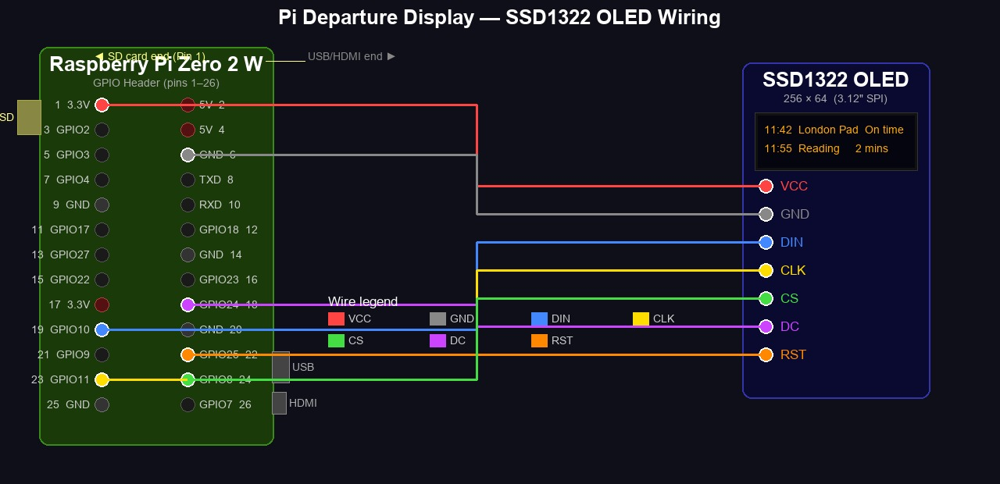

# Pi Train Departure Display — Requirements

## Overview

A self-hosted UK National Rail departure board that runs **natively on a Raspberry Pi Zero W** without Docker, Balena, or any cloud management platform. The Pi calls the National Rail OpenLDBWS API directly, renders live departures on a 256×64 SSD1322 SPI OLED display, and starts automatically on boot.

This project is derived from [chrisys/train-departure-display](https://github.com/chrisys/train-departure-display) with the following key changes:
- Removed Balena/Docker dependency — runs directly on Raspberry Pi OS
- Configuration via `/etc/train-display/config` instead of Balena environment variables
- Bash installer (`install.sh`) that guides setup interactively, including API key input
- systemd service for process management, autostart, and crash recovery
- Scheduled weekly reboot via systemd timer
- Hardened error handling, exponential back-off, and stale-data display on connectivity loss

---

## 1. Hardware Requirements

| Component | Requirement |
|---|---|
| **Primary device** | Raspberry Pi Zero W |
| **Also supported** | Raspberry Pi Zero 2W, Pi 3B, Pi 3B+, Pi 4 |
| **Display** | SSD1322 256×64 OLED, SPI interface (e.g. DIYTZT 3.12" 256×64 module) |
| **Display interface** | 7-pin SPI: VCC, GND, DIN (MOSI), CLK (SCLK), CS (CE0), DC, RST |
| **Storage** | SD card ≥ 8 GB |
| **OS** | Raspberry Pi OS Lite **(Bookworm)**; 32-bit for Zero W, 32 or 64-bit for Zero 2W. Bookworm required for Raspberry Pi Connect support |
| **Network** | Wi-Fi or Ethernet (required for API access) |

### SSD1322 GPIO Wiring (Pi Zero W / Zero 2W)

**Orientation:** Pin 1 is at the corner of the GPIO header closest to the SD card slot.



```
GPIO header — viewed from above, SD card end on the left

  Pin 1  [ 3V3 ●]── VCC    [  5V  ]  Pin 2
  Pin 3  [ SDA  ]          [  5V  ]  Pin 4
  Pin 5  [ SCL  ]          [ GND ●]── GND   Pin 6
  Pin 7  [GPIO4 ]          [ TXD  ]  Pin 8
  Pin 9  [ GND  ]          [ RXD  ]  Pin 10
  Pin 11 [GPIO17]          [GPIO18]  Pin 12
  Pin 13 [GPIO27]          [ GND  ]  Pin 14
  Pin 15 [GPIO22]          [GPIO23]  Pin 16
  Pin 17 [ 3V3  ]          [GPIO24●]── DC   Pin 18
  Pin 19 [GPIO10●]── DIN   [ GND  ]  Pin 20
  Pin 21 [ GPIO9]          [GPIO25●]── RST  Pin 22
  Pin 23 [GPIO11●]── CLK   [GPIO8 ●]── CS  Pin 24
  Pin 25 [ GND  ]          [ GPIO7 ]  Pin 26

  ● = connected to OLED
```

| OLED Pin | Function | GPIO | Physical Pin |
|---|---|---|---|
| VCC | 3.3V power | 3.3V | Pin 1 |
| GND | Ground | GND | Pin 6 |
| DIN | SPI data (MOSI) | GPIO 10 | Pin 19 |
| CLK | SPI clock (SCLK) | GPIO 11 | Pin 23 |
| CS | Chip select (screen 1) | GPIO 8 (CE0) | Pin 24 |
| DC | Data/command select | GPIO 24 | Pin 18 |
| RST | Reset | GPIO 25 | Pin 22 |
| CS2 | Chip select (screen 2, dual-screen only) | GPIO 7 (CE1) | Pin 26 |

---

## 2. Software Stack

| Component | Version / Package |
|---|---|
| **Python** | 3.9+ (system Python on Pi OS) |
| **luma.oled** | ≥ 3.13.0 — OLED display driver |
| **luma.core** | ≥ 2.4.2 — display rendering framework |
| **Pillow** | ≥ 11.1.0 — image/font rendering (11.x required for Python 3.13) |
| **requests** | ≥ 2.31.0 — HTTP client for API calls |
| **xmltodict** | ≥ 0.13.0 — SOAP XML parsing |
| **RPi.GPIO** | ≥ 0.7.1 — GPIO control |
| **spidev** | ≥ 3.6 — SPI interface |
| **urllib3** | ≥ 2.2.0 — HTTP connection pooling |
| **flask** | ≥ 3.0.3 — web configuration portal |
| **systemd** | system package — service management |
| **git** | system package — source deployment |

**Dev-only dependencies** (`requirements-dev.txt`):
- `pytest >= 8.0`
- `pytest-mock >= 3.12`

---

## 3. Data Source — National Rail OpenLDBWS

| Item | Detail |
|---|---|
| **API** | National Rail Enquiries — Live Departure Boards Web Service (OpenLDBWS) |
| **Endpoint** | `https://lite.realtime.nationalrail.co.uk/OpenLDBWS/ldb11.asmx` |
| **Protocol** | SOAP 1.1 / XML over HTTPS |
| **Authentication** | API key in SOAP header (`<AccessToken><TokenValue>…</TokenValue></AccessToken>`) |
| **Registration** | https://realtime.nationalrail.co.uk/OpenLDBWSRegistration — allow 2–4 weeks |
| **Data returned** | Departures within 120-minute window: scheduled/actual time, platform, destination, operator, calling points, status |
| **Polling interval** | 120 seconds (configurable via `REFRESH_TIME`) |

---

## 4. Configuration

Configuration is stored in `/etc/train-display/config`, owned by `root:train-display`, permissions `640`. The file uses `KEY=value` shell syntax and is loaded as an `EnvironmentFile` by systemd.

| Variable | Required | Default | Description |
|---|---|---|---|
| `API_KEY` | Yes | — | National Rail OpenLDBWS API key |
| `DEPARTURE_STATION` | Yes | — | 3-letter CRS code of departure station (e.g. `PAD`, `WAT`, `MAN`) |
| `DESTINATION_STATION` | No | — | Filter departures to this destination CRS code |
| `PLATFORM_FILTER` | No | — | Regex to show only matching platform numbers (e.g. `^[12]$`) |
| `REFRESH_TIME` | No | `120` | Seconds between API polls |
| `SCREEN_ROTATION` | No | `2` | Display rotation: 0, 1, 2, or 3 |
| `SCREEN_BLANK_HOURS` | No | — | Blank display during these hours, format `HH-HH` (e.g. `22-06`) |
| `DUAL_SCREEN` | No | `false` | Drive a second SSD1322 on CE1 (GPIO 7) |
| `SCREEN2_PLATFORM` | No | — | Platform filter for second screen (requires `DUAL_SCREEN=true`) |
| `SHOW_DEPARTURE_NUMBERS` | No | `false` | Show departure index numbers (1, 2, 3) |
| `FIRST_DEPARTURE_BOLD` | No | `true` | Render first departure row in bold |
| `DEBUG` | No | `false` | Run without display hardware (log-only mode) |
| `PORTAL_ENABLED` | No | `true` | Enable the web configuration portal |
| `PORTAL_PORT` | No | random 8000–9999 | Port for the web configuration portal |
| `PORTAL_PASSWORD` | No | — | PBKDF2-SHA256 hash of portal password; empty = localhost-only |

---

## 5. Display Behaviour

| ID | Requirement |
|---|---|
| DISP-01 | Show up to 3 next departures on the 256×64 OLED canvas |
| DISP-02 | Each row: scheduled departure time, destination, platform number, service status |
| DISP-03 | Calling stations for the first departure scroll horizontally in a continuous animation |
| DISP-04 | Dot-matrix font aesthetic matching original project fonts |
| DISP-05 | Display blanks automatically during `SCREEN_BLANK_HOURS`; a minimal clock may be shown |
| DISP-06 | Attribution/loading screen displayed on startup while initial data is fetched |
| DISP-07 | First departure rendered in bold when `FIRST_DEPARTURE_BOLD=true` |
| DISP-08 | Dual screen mode: second SSD1322 shows departures filtered by `SCREEN2_PLATFORM` |
| DISP-09 | Bottom row shows current date (left, regular font, format `Ddd DDth Month` e.g. `Fri 13th March`) and current time (right, large bold font, `HH:MM`); date and time update every render cycle |

---

## 6. Installer (`install.sh`)

A bash script run **directly on the Pi** as root. The installer is idempotent — re-running it updates configuration and restarts the service.

| ID | Requirement |
|---|---|
| INST-01 | Validates it is running on a Raspberry Pi; exits with a clear message if not |
| INST-02 | Checks prerequisites: Python 3.9+, pip3, git; installs missing packages via `apt` |
| INST-03 | Enables SPI interface via `raspi-config nonint do_spi 0` if not already enabled |
| INST-04 | Clones the repo to `/opt/train-display/` or does `git pull` if already present |
| INST-05 | Creates a Python venv at `/opt/train-display/.venv` and installs `requirements.txt` |
| INST-06 | Creates `train-display` system user and group (no login shell, no home directory) if absent |
| INST-07 | Adds `train-display` user to `gpio` and `spi` groups for hardware access |
| INST-08 | Prompts interactively for `API_KEY` using `read -s` (hidden input, not echoed) |
| INST-09 | Prompts for `DEPARTURE_STATION` with CRS code hint and format validation (3 uppercase letters) |
| INST-10 | Optionally prompts for portal password (hidden input); if set, hashes with PBKDF2-SHA256 |
| INST-11 | Assigns a random portal port in the range 8000–9999; user may override at the prompt |
| INST-12 | Writes `/etc/train-display/config` with permissions `640`, owner `root:train-display`; portal enabled by default |
| INST-13 | Installs and enables `train-display.service`; does not auto-start — user starts manually after validation |
| INST-14 | Runs `validate.py` to confirm API connectivity before service is started |
| INST-15 | Prints post-install summary including portal URL; directs user to portal for all further configuration |
| INST-16 | Prints Raspberry Pi Connect URL (`connect.raspberrypi.com`) for ongoing remote management |
| INST-17 | Weekly reboot timer unit files shipped in repo; enabled manually post-install (not part of core installer) |

---

## 7. systemd Service

**File:** `/etc/systemd/system/train-display.service`

```ini
[Unit]
Description=Train Departure Display
After=network-online.target
Wants=network-online.target

[Service]
Type=simple
User=train-display
Group=train-display
EnvironmentFile=/etc/train-display/config
ExecStart=/opt/train-display/.venv/bin/python /opt/train-display/src/main.py
Restart=on-failure
RestartSec=10

[Install]
WantedBy=multi-user.target
```

Key behaviours:
- `After=network-online.target` — waits for network connectivity before first API call (BOOT-02)
- `Restart=on-failure` — automatically restarts on crash (BOOT-01)
- Unprivileged `train-display` user in `gpio`/`spi` groups — no root required (SEC-03, SEC-04)

---

## 8. Boot & Scheduled Restart

**Auto-start on boot:**

| ID | Requirement |
|---|---|
| BOOT-01 | Service enabled at install via `systemctl enable train-display` — starts after every reboot |
| BOOT-02 | Unit declares `After=network-online.target` so it waits for network before starting |
| BOOT-03 | If network is unavailable, app retries silently and shows loading screen (no crash) |

**Scheduled weekly reboot:**

| ID | Requirement |
|---|---|
| REBOOT-01 | `train-display-reboot.timer` triggers a full system reboot every 7 days |
| REBOOT-02 | Default schedule: Sunday at 03:00 local time (configurable during install) |
| REBOOT-03 | Timer unit files shipped in the repo under `systemd/`; enabled manually post-install (not part of core installer) |
| REBOOT-04 | Reboot performed via `systemctl reboot` (clean shutdown sequence) |
| REBOOT-05 | Timer and schedule documented in `INSTALL.md` with instructions to change or disable |

---

## 9. Update Mechanism

- `update.sh` performs: `git -C /opt/train-display pull && pip install -r requirements.txt && systemctl restart train-display`
- No OTA — manual pull on the Pi is the supported update path
- **Reconfiguration:** all settings (station, filters, display options, portal password) managed via the web portal; re-running `install.sh` is only required to change `API_KEY` or `DEPARTURE_STATION`

---

## 10. Security Requirements

| ID | Requirement |
|---|---|
| SEC-01 | `API_KEY` never written to logs, tracebacks, or stdout under any circumstances |
| SEC-02 | Config file permissions `640`, owned `root:train-display` |
| SEC-03 | Service runs as unprivileged `train-display` user, not root |
| SEC-04 | `train-display` user added to `gpio` and `spi` groups for hardware access |
| SEC-05 | API key collected in installer with `read -s` — not exposed in shell history |
| SEC-06 | HTTPS enforced for OpenLDBWS endpoint; no HTTP fallback |
| SEC-07 | `requests` SSL verification always enabled (`verify=True`) |
| SEC-08 | No hardcoded credentials, station codes, or tokens in source |
| SEC-09 | No use of `eval`, `os.system`, or `subprocess` with config-derived values |
| SEC-10 | Startup checks config file permissions; logs a warning if world-readable |
| SEC-11 | Python dependency versions pinned in `requirements.txt` |
| SEC-12 | `PORTAL_PASSWORD` stored as PBKDF2-HMAC-SHA256 hash (260 000 iterations, random 16-byte salt); never stored or logged in plaintext |
| SEC-13 | Portal enforces localhost-only access when `PORTAL_PASSWORD` is empty; remote access blocked with HTTP 403 |
| SEC-14 | Portal uses HTTP Basic Auth over LAN when `PORTAL_PASSWORD` is set; password verified via constant-time compare |

---

## 11. Architectural Resilience

| ID | Requirement |
|---|---|
| ARCH-01 | API call wrapped in try/except with exponential back-off: 2s → 4s → 8s → … → 120s cap |
| ARCH-02 | On API failure, display continues showing last known departures with a "No signal" indicator |
| ARCH-03 | After 3 consecutive API failures, display shows a dedicated connectivity warning screen |
| ARCH-04 | Network unavailable at startup: retry loop with loading screen — no unhandled exception |
| ARCH-05 | SPI/display initialisation failure: log clear error and exit with code 1 (no infinite loop) |
| ARCH-06 | Config validation runs at startup before any I/O; missing required fields exit with a clear message |
| ARCH-07 | Data shared between API-fetch thread and render thread protected by a `threading.Lock` |
| ARCH-08 | SIGTERM handler set at startup; graceful shutdown completes current render cycle before exit |
| ARCH-09 | Bitmap text cache bounded to a maximum of 256 entries (LRU eviction) to protect Pi Zero RAM |
| ARCH-10 | All caught exceptions logged with: station code, attempt number, error type — never the API key |

---

## 12. Python Test Suite

| ID | Requirement |
|---|---|
| TEST-01 | `tests/` directory at project root; all tests runnable with `pytest` |
| TEST-02 | `tests/test_trains.py`: mock SOAP XML responses; verify correct parsing of on-time, delayed, cancelled, empty-service, and malformed individual-service responses (malformed service skipped, valid siblings returned); `loadDeparturesForStation` tested with mocked HTTP including timeout, connection error, HTTP error, missing config, and SSL verification |
| TEST-03 | `tests/test_config.py`: missing required fields raise `ValueError`; defaults applied correctly; CRS validation; blank-hours parsing |
| TEST-04 | `tests/test_display.py`: calling-point scroll offset logic; bold/normal row selection; blank-hours active/inactive check |
| TEST-05 | All tests runnable without physical display hardware — luma device mocked via `pytest-mock` |
| TEST-06 | `requirements-dev.txt` lists `pytest` and `pytest-mock` as dev-only dependencies |
| TEST-07 | `pytest --tb=short -q` exits non-zero on any failure (CI-friendly) |
| TEST-08 | `tests/test_display.py`: ordinal date suffix helper tested for 1st/2nd/3rd/4th, 11th/12th/13th (special cases), 21st/22nd/23rd boundary values |
| TEST-09 | `tests/test_portal.py`: portal auth tested for local/remote × password-set/not-set; correct/wrong credentials; config-load failure fails closed |
| TEST-10 | `tests/test_portal.py`: `/save` tested for API key masking, new key, password hashing, password clear, restart event, validation errors, permission errors |
| TEST-11 | `tests/test_portal.py`: `/status`, `/sysinfo`, `/health` endpoints tested for correct response schema and auth requirements |
| TEST-12 | `tests/test_config.py`: `hash_password` / `verify_password` tested for correct format, round-trip, wrong password, legacy plaintext, malformed hash |
| TEST-13 | `tests/test_config.py`: `load_raw_config` / `save_raw_config` tested for parsing, quote stripping, comment handling, atomic write, round-trip |
| TEST-14 | `tests/test_config.py`: `validate_portal_config` tested for all required fields, CRS format, numeric ranges, blank-hours format |

---

## 13. API Validation Tool (`validate.py`)

A standalone script run on the Pi after install to confirm end-to-end connectivity.

| ID | Requirement |
|---|---|
| VAL-01 | Runnable as `python /opt/train-display/validate.py` or `.venv/bin/python validate.py` |
| VAL-02 | Reads config from `/etc/train-display/config` (same path as the service) |
| VAL-03 | Check 1: config file exists and is readable |
| VAL-04 | Check 2: `API_KEY` is set (prints `API_KEY: set` — never the value) |
| VAL-05 | Check 3: `DEPARTURE_STATION` is set and matches CRS format |
| VAL-06 | Check 4: live HTTPS call to OpenLDBWS returns HTTP 200 with valid XML |
| VAL-07 | Check 5: at least one departure parsed from response |
| VAL-08 | Prints next departure (time, destination, platform) on success |
| VAL-09 | Each check prints `[ PASS ]` or `[ FAIL ] <reason>` |
| VAL-10 | Exits code 0 if all checks pass; non-zero if any fail |

---

## 14. Project Documentation Files

| File | Purpose |
|---|---|
| `REQUIREMENTS.md` | This document — canonical requirements reference |
| `INSTALL.md` | Human-readable installer and wiring guide |
| `README.md` | Overview, quick-start, hardware photo, licence |

---

## 15. Web Configuration Portal

A Flask web application running as a third thread within the same process, providing browser-based configuration without SSH access.

| ID | Requirement |
|---|---|
| PORTAL-01 | Portal starts on `0.0.0.0` at the configured port; accessible from any device on the same network |
| PORTAL-02 | Auth model: empty `PORTAL_PASSWORD` → localhost-only (127.0.0.1 / ::1); set → HTTP Basic Auth from all origins |
| PORTAL-03 | `API_KEY` masked in the UI with `••••••••`; only replaced when a new value is explicitly entered |
| PORTAL-04 | All configurable variables editable via form: `DEPARTURE_STATION`, `DESTINATION_STATION`, `PLATFORM_FILTER`, `SCREEN_BLANK_HOURS`, `REFRESH_TIME`, `SCREEN_ROTATION`, `FIRST_DEPARTURE_BOLD`, `SHOW_DEPARTURE_NUMBERS`, `DUAL_SCREEN`, `PORTAL_PASSWORD`, `PORTAL_PORT` |
| PORTAL-05 | Config saved atomically via `os.replace()`; service restarts automatically after save |
| PORTAL-06 | `/status` endpoint returns current departure state as JSON (polled by page every 10 s) |
| PORTAL-07 | `/sysinfo` endpoint returns connected WiFi SSID and signal level in dBm (no auth required) |
| PORTAL-08 | `/health` endpoint returns `{"ok": true}` with no auth required (liveness probe) |
| PORTAL-09 | Page displays: live departures table, WiFi SSID + 4-bar signal strength, live clock (updated every second via JS) |
| PORTAL-10 | Portal password change: new value hashed with PBKDF2-SHA256 before storing; clearing the field reverts to localhost-only mode |

---

## 16. Out of Scope

- Journey planning, ticket purchasing, arrivals boards
- iOS, macOS, or Windows support
- Arrivals boards or journey planning
- OTA (over-the-air) updates
- National Rail Darwin push feed (polling only in this version)
- Any cloud service dependency (Balena, AWS, GCP, etc.)
